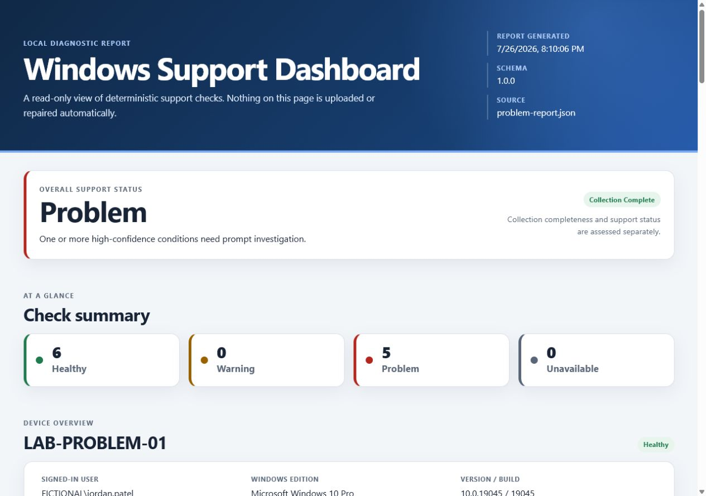
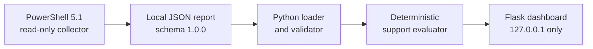

# Windows Support Diagnostic Toolkit

Windows Support Diagnostic Toolkit is a local portfolio project for entry-level
Product Support, Software Support, and IT Support work. A read-only PowerShell
collector produces a structured JSON report, and a small Flask dashboard helps
the user review that report.

The toolkit runs entirely on the local computer. It does not upload reports,
use telemetry, look up public IP addresses, or expose the dashboard beyond
`127.0.0.1`.



_Portfolio screenshot generated from fictional test data. It contains no real
device, user, network, or event information._

## Portfolio highlights

- Demonstrates practical Windows troubleshooting across system, resource,
  network, service, and Event Viewer data.
- Separates read-only data collection, JSON contract validation, deterministic
  evaluation, and presentation into clear components.
- Converts technical evidence into concise explanations and safe manual next
  actions without claiming an automated diagnosis.
- Handles partial collection, unavailable data, malformed JSON, and unsupported
  report versions without stopping the whole workflow.
- Uses synthetic fixtures and automated boundary tests to protect real
  machine-specific diagnostic information.

## What the toolkit shows

- Windows, device, processor, and memory details
- Disk capacity and free-space checks
- Local network adapter, IP, gateway, and DNS configuration
- Selected Windows service states and startup modes
- A bounded set of recent Application and System errors
- Collection completeness and collection errors
- Deterministic Healthy, Warning, Problem, and Unavailable support findings
- Evidence, plain-English explanations, and safe suggested next actions

The dashboard is a support aid, not an automated diagnosis or repair tool.

## How it works



Every step runs locally. The Flask process reads an existing report; it does
not invoke PowerShell, modify the report, repair Windows, or make network
requests.

| Status | Meaning |
| --- | --- |
| Healthy | The limited check did not trigger a warning or problem rule. |
| Warning | An observation deserves review or may affect reliability. |
| Problem | A high-confidence rule found a condition likely to cause impact. |
| Unavailable | The observation could not be collected or assessed reliably. |

Disk status is based on percentage free for each fixed disk: 20% or more is
Healthy, below 20% is Warning, and below 5% is Problem. The dashboard still
shows the actual total and free GB as supporting evidence.

## Requirements

- Windows PowerShell 5.1 for collecting a report
- Python 3.10 or later for the dashboard (Python 3.12 is supported)
- A modern local web browser

## Dashboard setup

Open PowerShell and run:

```powershell
Set-Location 'C:\path\to\windows-support-diagnostic-toolkit'
python -m venv .venv
.\.venv\Scripts\Activate.ps1
python -m pip install -r requirements-dev.txt
```

If PowerShell blocks the activation script, allow local script execution for
only the current PowerShell process, then activate the environment:

```powershell
Set-ExecutionPolicy -Scope Process -ExecutionPolicy Bypass
.\.venv\Scripts\Activate.ps1
```

## Run the dashboard

Use the synthetic sample report:

```powershell
python -m dashboard
```

Open <http://127.0.0.1:5000> in a browser. Press `Ctrl+C` in PowerShell to stop
the server.

Select a specific report with a command-line option:

```powershell
python -m dashboard --report '.\reports\first-report.json'
```

To connect that diagnostic report to a storage analysis, select both local
files when starting the dashboard:

```powershell
python -m dashboard `
  --report '.\reports\first-report.json' `
  --storage-report '.\storage-reports\YOUR-STORAGE-REPORT.json'
```

Repeat `--storage-report` to keep independent C: and F: analyses available in
the same dashboard session:

```powershell
python -m dashboard `
  --report '.\reports\first-report.json' `
  --storage-report '.\storage-reports\c-drive-report.json' `
  --storage-report '.\storage-reports\f-drive-report.json'
```

Each disk card is an accessible link to its per-drive storage page. The page
shows a non-overlapping capacity chart, scan completeness, inaccessible paths,
candidate totals, and a read-only candidate explorer. A **Files / Folders**
switch changes between individual-file evidence and aggregated folder-tree
evidence from the same report. Candidates can be filtered with explicit
`Match all` or `Match any` behavior, sorted, selected, copied, opened in File
Explorer, or exported as a local review plan. An explicit **Review Recycle Bin
action** opens a final exact-path preview. Only a separately confirmed POST
action can move eligible files or folder trees to the Windows Recycle Bin. If a
custom diagnostic report has no selected storage analysis, the page explains
how to create one instead of starting a scan silently.

Guided cleanup never permanently deletes an item as a fallback. It rechecks
every selected file and every descendant of a selected folder immediately
before the Recycle Bin call. Parent and child folders cannot be selected in the
same operation. Folder actions always require a typed confirmation phrase, and
high-risk application, save-data, configuration, and AppData trees remain
review-only. Per-item outcomes are stored only under ignored
`cleanup-records/`. See
[`docs/guided-cleanup.md`](docs/guided-cleanup.md) for the full safety model.

Alternatively, select a report through an environment variable:

```powershell
$env:DIAGNOSTIC_REPORT_PATH = (Resolve-Path '.\reports\first-report.json').Path
python -m dashboard
Remove-Item Env:DIAGNOSTIC_REPORT_PATH
```

The command-line `--report` option takes priority over the environment
variable. If neither is supplied, the dashboard loads
`sample_data/sample-report.json`.

Storage analysis selection follows the same pattern. `--storage-report` takes
priority over `STORAGE_REPORT_PATH`. The fictional default diagnostic sample
uses `sample_data/sample-storage-report.json`; custom diagnostic reports do not
silently inherit that sample.

## Generate a local diagnostic report

From the repository root:

```powershell
powershell.exe -NoProfile -ExecutionPolicy Bypass -File '.\collector\Collect-Diagnostics.ps1' -OutputPath '.\reports\first-report.json'
```

The generated report is saved at `reports\first-report.json` under the
repository. The `reports/` directory is ignored by Git because real reports
contain machine-specific diagnostic information.

## Manual dashboard scenarios

Stop the server with `Ctrl+C` before starting the next scenario.

Warning fixture:

```powershell
python -m dashboard --report '.\tests\fixtures\warning-report.json'
```

Problem fixture:

```powershell
python -m dashboard --report '.\tests\fixtures\problem-report.json'
```

Missing report:

```powershell
python -m dashboard --report '.\reports\does-not-exist.json'
```

Malformed JSON:

```powershell
python -m dashboard --report '.\tests\fixtures\malformed-report.json'
```

Each error scenario displays a friendly local error page instead of exposing a
Python traceback.

## Automated tests

With the virtual environment active, run all Python dashboard tests:

```powershell
python -m pytest tests\dashboard -q
```

Run the existing JSON contract and collector safety tests:

```powershell
powershell.exe -NoProfile -ExecutionPolicy Bypass -File '.\tests\Test-ReportContract.ps1'
powershell.exe -NoProfile -ExecutionPolicy Bypass -File '.\tests\Test-CollectorSafety.ps1'
```

Run every Python test discovered in the repository:

```powershell
python -m pytest -q
```

## Privacy and safety

The collector does not collect passwords, authentication tokens, Windows
product keys, saved Wi-Fi passwords or profiles, browser history, personal
documents, public IP data, or Windows Security event logs. Event collection is
limited to the 10 newest Critical or Error events from each of the Application
and System logs during the previous 24 hours.

Reports are read locally and rendered with HTML escaping. The dashboard never
uploads, modifies, or transmits report data. Flask binds only to
`127.0.0.1`, so the dashboard is not intentionally available to other devices.

Additional local safeguards:

- Report reads are capped at 5 MiB before parsing. Normal bounded collector
  reports are far smaller.
- The report path is selected when the server starts; browser query parameters
  and form submissions cannot replace or upload a report.
- Invalid JSON, incompatible schemas, oversized reports, and unavailable files
  produce friendly local error pages without tracebacks.
- Responses disable caching, framing, referrer data, MIME sniffing, and
  unnecessary browser permissions.

## Storage extension development

The optional **Storage Insights and Guided Cleanup** extension is developed
milestone by milestone on the `storage-extension` integration branch. Its
public roadmap is in
[`STORAGE_EXTENSION_PLAN.md`](STORAGE_EXTENSION_PLAN.md).

Milestone 1 defines an independent storage-analysis contract and synthetic
fixtures. Milestone 2 adds a separately invoked, read-only metadata scanner.
Milestone 3 connects disk cards to an accessible per-drive dashboard with a
non-overlapping storage chart and scan completeness. Milestone 4 adds a
read-only candidate explorer with deterministic filtering, sorting,
visible-only selection, copy-path, open-folder, and local review-plan export.
Milestone 5 adds a guarded exact-path review and Recycle Bin-only confirmation
with per-file revalidation and results. Milestone 6 adds informational Python
environment, supported pip-cache, and Java runtime insights without making
runtimes automatic cleanup candidates. Milestone 7 hardens whole-drive
accounting and failure paths. Milestone 8 adds folder-tree aggregation, a
Files/Folders explorer switch, and conservative folder cleanup safeguards while
preserving the existing file workflow. See
[`docs/storage-report-contract.md`](docs/storage-report-contract.md) and
[`docs/development-storage-insights.md`](docs/development-storage-insights.md).

The V2 File-Type Explorer uses a separate versioned per-drive index for ranked
folder totals and extension-aware review. Its contract, fictional sample, and
explicit whole-drive indexer are documented in
[`docs/file-type-index-contract.md`](docs/file-type-index-contract.md).

Create one ignored local index per drive with:

```powershell
python -m storage.file_type_indexer --drive 'C:\' --output 'c-file-type-index.json'
python -m storage.file_type_indexer --drive 'F:\' --output 'f-file-type-index.json'
```

The V2 ranked-tree dashboard is a later milestone; creating an index does not
change the current storage dashboard or perform cleanup.

Real scans are written only to ignored `storage-reports/`.

Run the scanner explicitly from PowerShell:

```powershell
python -m storage --root "$env:USERPROFILE\Downloads"
```

To analyse all accessible, non-protected folders from an actual drive root,
run one explicit scan per drive:

```powershell
python -m storage --root 'C:\' --output 'c-drive-report.json'
python -m storage --root 'F:\' --output 'f-drive-report.json'
```

Drive-root scans may take much longer and may finish as partial when Windows
denies access. Protected operating-system, application, recovery, Recycle Bin,
reparse-point, and unreadable locations are reported or skipped and are never
offered as cleanup candidates.

Then display the generated report alongside a diagnostic report:

```powershell
python -m dashboard `
  --report '.\reports\first-report.json' `
  --storage-report '.\storage-reports\c-drive-report.json' `
  --storage-report '.\storage-reports\f-drive-report.json'
```

Each new per-drive storage report contains both file and folder candidates. A
second folder-specific scan is not required; old reports must be regenerated to
enable the Folders view.

Development discovery is enabled for storage scans by default. It recognises
`pyvenv.cfg` markers without reading their contents, queries pip's supported
cache-location command, and reads supported Java runtime properties when Java
is available. Only selected scan roots are measured. The dashboard never runs
cache cleanup commands automatically.

## Project structure

```text
collector/             Read-only PowerShell diagnostic collector
dashboard/             Local Flask application, templates, and static files
docs/                  Public diagnostic and storage-contract documentation
sample_data/           Trackable fictional diagnostic and storage reports
schema/                Independent diagnostic and storage JSON Schemas
storage/               Storage scanner, classifier, and guarded cleanup rules
tests/dashboard/       Dashboard tests
tests/fixtures/        Trackable fictional contract fixtures
tests/storage/         Storage contract tests and fictional fixtures
tests/*.ps1            Collector and contract tests
reports/               Ignored local reports
storage-reports/       Ignored local storage-analysis reports
cleanup-records/       Ignored local per-item cleanup result records
```

## Current limitations

- The dashboard supports report schema version `1.0.0` only.
- Diagnostic reports larger than 5 MiB and storage reports larger than 50 MiB
  are rejected.
- One diagnostic report and multiple independent per-drive storage reports can
  be selected when the server starts.
- Guided cleanup supports eligible regular files and conservatively classified
  folder trees. It does not request elevation, empty the Recycle Bin, or
  permanently delete.
- Folder candidate totals overlap by hierarchy and are not drive-accounting
  totals. Folder sizes can overestimate recoverable physical space when hard
  links appear at several paths.
- Recycle Bin recovery is controlled by Windows and is not guaranteed
  indefinitely.
- Development locations outside selected roots are displayed but not measured;
  no universal Java cache is assumed.
- `Open folder` is available for eligible and review-only file or folder
  candidates whose target directory still exists and passes current path
  checks.
- Statuses use documented deterministic thresholds and are not AI diagnoses.
- The Flask development server is intended only for local use.
- There is no report history, database, authentication, remote access,
  automatic repair, or multi-operating-system support.

## Troubleshooting

### `python` is not recognized

Install a supported Python release from
[python.org](https://www.python.org/downloads/windows/), enable the installer
option to add Python to `PATH`, open a new PowerShell window, and confirm:

```powershell
python --version
python -m pip --version
```

### Port 5000 is already in use

Start the local dashboard on another loopback port:

```powershell
python -m dashboard --port 5050
```

Then open <http://127.0.0.1:5050>.

### The report is missing or invalid

Confirm the selected path exists and regenerate the report when necessary:

```powershell
Test-Path '.\reports\first-report.json'
python -m dashboard --report '.\reports\first-report.json'
```

The dashboard supports contract version `1.0.0`. Missing, malformed, or
incompatible reports show a local error page rather than a Python traceback.
