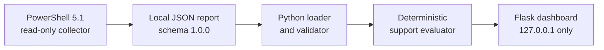

# Windows Support Diagnostic Toolkit

Windows Support Diagnostic Toolkit is a local portfolio project for entry-level
Product Support, Software Support, and IT Support work. A read-only PowerShell
collector produces a structured JSON report, and a small Flask dashboard helps
the user review that report.

The toolkit runs entirely on the local computer. It does not upload reports,
use telemetry, look up public IP addresses, or expose the dashboard beyond
`127.0.0.1`.


_Portfolio screenshot generated from fictional test data. It contains no real
device, user, network, or event information._

## Portfolio highlights

- Demonstrates practical Windows troubleshooting across system, resource,
  network, service, and Event Viewer data.
- Separates read-only data collection, JSON contract validation, deterministic
  evaluation, and presentation into clear components.
- Converts technical evidence into concise explanations and safe manual next
  actions without claiming an automated diagnosis.
- Handles partial collection, unavailable data, malformed JSON, and unsupported
  report versions without stopping the whole workflow.
- Uses synthetic fixtures and automated boundary tests to protect real
  machine-specific diagnostic information.

## What the toolkit shows

- Windows, device, processor, and memory details
- Disk capacity and free-space checks
- Local network adapter, IP, gateway, and DNS configuration
- Selected Windows service states and startup modes
- A bounded set of recent Application and System errors
- Collection completeness and collection errors
- Deterministic Healthy, Warning, Problem, and Unavailable support findings
- Evidence, plain-English explanations, and safe suggested next actions

The dashboard is a support aid, not an automated diagnosis or repair tool.

## How it works



Every step runs locally. The Flask process reads an existing report; it does
not invoke PowerShell, modify the report, repair Windows, or make network
requests.

| Status | Meaning |
| --- | --- |
| Healthy | The limited check did not trigger a warning or problem rule. |
| Warning | An observation deserves review or may affect reliability. |
| Problem | A high-confidence rule found a condition likely to cause impact. |
| Unavailable | The observation could not be collected or assessed reliably. |

## Requirements

- Windows PowerShell 5.1 for collecting a report
- Python 3.10 or later for the dashboard (Python 3.12 is supported)
- A modern local web browser

## Dashboard setup

Open PowerShell and run:

```powershell
Set-Location 'C:\path\to\windows-support-diagnostic-toolkit'
python -m venv .venv
.\.venv\Scripts\Activate.ps1
python -m pip install -r requirements-dev.txt
```

If PowerShell blocks the activation script, allow local script execution for
only the current PowerShell process, then activate the environment:

```powershell
Set-ExecutionPolicy -Scope Process -ExecutionPolicy Bypass
.\.venv\Scripts\Activate.ps1
```

## Run the dashboard

Use the synthetic sample report:

```powershell
python -m dashboard
```

Open <http://127.0.0.1:5000> in a browser. Press `Ctrl+C` in PowerShell to stop
the server.

Select a specific report with a command-line option:

```powershell
python -m dashboard --report '.\reports\first-report.json'
```

Alternatively, select a report through an environment variable:

```powershell
$env:DIAGNOSTIC_REPORT_PATH = (Resolve-Path '.\reports\first-report.json').Path
python -m dashboard
Remove-Item Env:DIAGNOSTIC_REPORT_PATH
```

The command-line `--report` option takes priority over the environment
variable. If neither is supplied, the dashboard loads
`sample_data/sample-report.json`.

## Generate a local diagnostic report

From the repository root:

```powershell
powershell.exe -NoProfile -ExecutionPolicy Bypass -File '.\collector\Collect-Diagnostics.ps1' -OutputPath '.\reports\first-report.json'
```

The generated report is saved at `reports\first-report.json` under the
repository. The `reports/` directory is ignored by Git because real reports
contain machine-specific diagnostic information.

## Manual dashboard scenarios

Stop the server with `Ctrl+C` before starting the next scenario.

Warning fixture:

```powershell
python -m dashboard --report '.\tests\fixtures\warning-report.json'
```

Problem fixture:

```powershell
python -m dashboard --report '.\tests\fixtures\problem-report.json'
```

Missing report:

```powershell
python -m dashboard --report '.\reports\does-not-exist.json'
```

Malformed JSON:

```powershell
python -m dashboard --report '.\tests\fixtures\malformed-report.json'
```

Each error scenario displays a friendly local error page instead of exposing a
Python traceback.

## Automated tests

With the virtual environment active, run all Python dashboard tests:

```powershell
python -m pytest tests\dashboard -q
```

Run the existing JSON contract and collector safety tests:

```powershell
powershell.exe -NoProfile -ExecutionPolicy Bypass -File '.\tests\Test-ReportContract.ps1'
powershell.exe -NoProfile -ExecutionPolicy Bypass -File '.\tests\Test-CollectorSafety.ps1'
```

Run every Python test discovered in the repository:

```powershell
python -m pytest -q
```

## Privacy and safety

The collector does not collect passwords, authentication tokens, Windows
product keys, saved Wi-Fi passwords or profiles, browser history, personal
documents, public IP data, or Windows Security event logs. Event collection is
limited to the 10 newest Critical or Error events from each of the Application
and System logs during the previous 24 hours.

Reports are read locally and rendered with HTML escaping. The dashboard never
uploads, modifies, or transmits report data. Flask binds only to
`127.0.0.1`, so the dashboard is not intentionally available to other devices.

## Project structure

```text
collector/             Read-only PowerShell diagnostic collector
dashboard/             Local Flask application, templates, and static files
docs/                  Public report-contract documentation
sample_data/           Trackable fictional sample report
schema/                JSON Schema for report contract 1.0.0
tests/dashboard/       Dashboard tests
tests/fixtures/        Trackable fictional contract fixtures
tests/*.ps1            Collector and contract tests
reports/               Ignored local reports
```

## Current limitations

- The dashboard supports report schema version `1.0.0` only.
- One report path is selected when the server starts; switch reports by
  stopping and restarting the server.
- Statuses use documented deterministic thresholds and are not AI diagnoses.
- The Flask development server is intended only for local use.
- There is no report history, database, authentication, remote access,
  automatic repair, or multi-operating-system support.

## Troubleshooting

### `python` is not recognized

Install a supported Python release from
[python.org](https://www.python.org/downloads/windows/), enable the installer
option to add Python to `PATH`, open a new PowerShell window, and confirm:

```powershell
python --version
python -m pip --version
```

### Port 5000 is already in use

Start the local dashboard on another loopback port:

```powershell
python -m dashboard --port 5050
```

Then open <http://127.0.0.1:5050>.

### The report is missing or invalid

Confirm the selected path exists and regenerate the report when necessary:

```powershell
Test-Path '.\reports\first-report.json'
python -m dashboard --report '.\reports\first-report.json'
```

The dashboard supports contract version `1.0.0`. Missing, malformed, or
incompatible reports show a local error page rather than a Python traceback.
